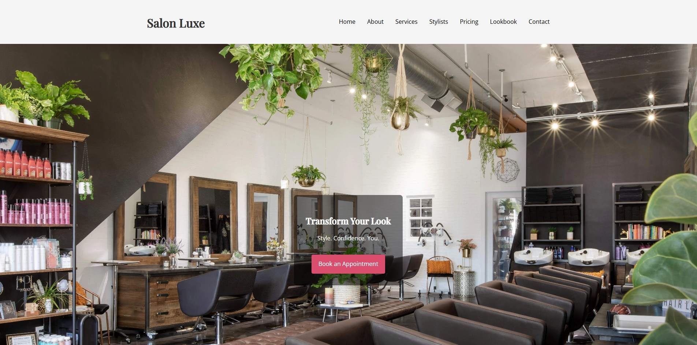

# Salon Luxe Website

This project is the original Salon Luxe website, created as my first full website project. It showcases a luxury hair salon with a simple, elegant design and core functionality. This version demonstrates my early web development skills and focuses on a clean, responsive layout with essential features.

## Table of contents

- [Overview](#overview)
  - [Screenshot](#screenshot)
  - [Links](#links)
- [My process](#my-process)
  - [Built with](#built-with)
  - [What I learned](#what-i-learned)
- [Author](#author)

## Overview
The old Salon Luxe site is a professional, single-page website for a luxury hair salon. It was built to provide visitors with essential information about services, stylists, pricing, and contact options.

Key features include:

- Hero section with an eye-catching image 🌟

- Services section highlighting haircuts, coloring, and styling ✂️

- Stylists section with images and specialties 🧑‍🎨

- Contact form with submission confirmation 📧

- Back-to-top button for smooth navigation ⬆️

- Responsive layout for desktop and mobile devices 📱

### Screenshot

### Links

- Old Site URL: [Salon Luxe (OLD)](https://lit-97.github.io/hair-salon-website/)
- New Site URL: [Salon Luxe (NEW)](https://salonluxelit.vercel.app/)

## My process
For this project, I focused on planning the structure of a one-page site and implementing a clean, functional layout. My process included:

1. Planning the one-page layout with sections for hero, services, stylists, and contact.

2. Writing semantic HTML for content organization.

3. Styling the site with CSS, using Flexbox and Grid for layout.

4. Adding interactivity with vanilla JavaScript, including smooth scroll and contact form handling.

5. Optimizing images for fast loading and responsive display.

6. Testing responsiveness across multiple devices.

### Built with

- HTML5

- CSS3 (Flexbox & Grid)

- JavaScript (Vanilla JS for interactivity)

- Google Fonts (Playfair Display & Open Sans)

- GitHub Pages (Hosting)

### Growth & Insights 🌱

- Learned how to structure a single-page site with multiple sections.

- Practiced responsive design for mobile-first layouts.

- Implemented basic interactivity using vanilla JavaScript (form handling, back-to-top button).

- Improved skills in image optimization and typography.

- Gained experience deploying a static website on GitHub Pages.

## Author

- Website - [My Portfolio](https://lit-97.github.io/portfolio/)
- GitHub  - [@Lit-97](https://github.com/Lit-97)
